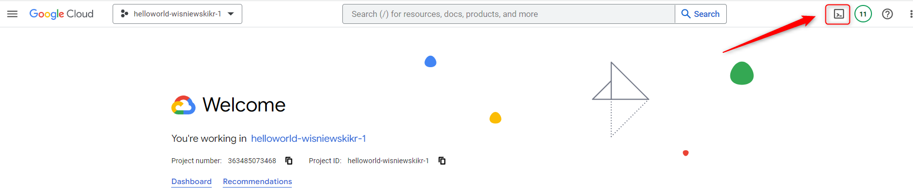
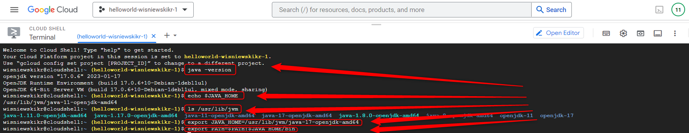
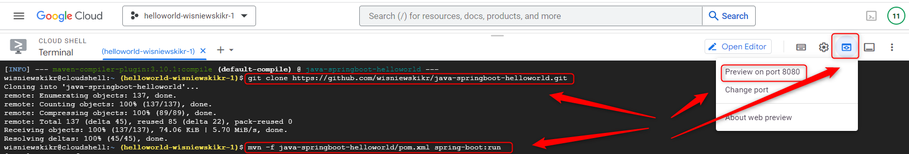
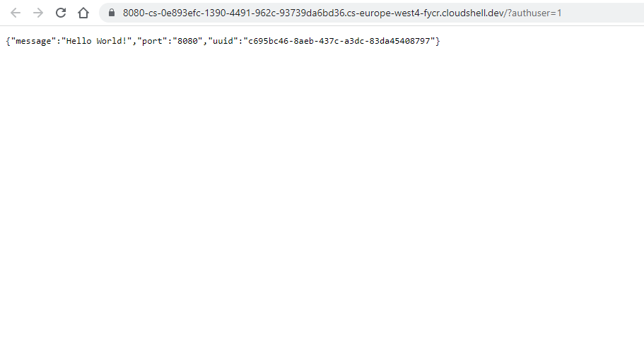
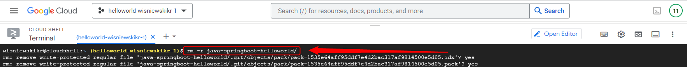

USAGE
-----

> **NOTE** This usage assumes that user possesses **Google Account** with existing **GCP Project**. It also assumes that **Java Spring Boot** application is already stored in **Github**.

> **ERROR FIXING** This example fixes error in GCP Cloud Shell - installed **Java** is in version **17** but variable **JAVA_HOME** is in version **11**. Variable is updated to version **17**. 

Steps:
1. Deploy application in GCP Cloud Shell. Please check section **DEPLOY IN CLOUD SHELL**
     * (Optional) Update variable JAVA_PATH with `export JAVA_HOME=/usr/lib/jvm/java-17-openjdk-amd64`
     * (Optional) Update variable PATH with `PATH=$PATH:$JAVA_HOME/bin`
     * Clone application from Github with `git clone https://github.com/wisniewskikr/java-springboot-helloworld.git`
     * Start application with `mvn -f java-springboot-helloworld/pom.xml spring-boot:run`
     * Visit application. Click button **Web Preview** and choose port **8080**
1. Delete application from GCP Cloud Shell. Please check section **DELETE FROM CLOUD SHELL**
     * Stop application with `ctrl + c` 
     * Remove cloned application with `rm -r java-springboot-helloworld`

DESCRIPTION
-----------

##### Goal
The goal of this project is to present how to deploy **Java Spring Boot** application on **GCP Cloud Shell** using **GCP Console**.

##### Terminology
Terminology explanation:
* **GCP**: it means Google Cloud Platform (GCP). There are compute services provided by Google via Internet
 **GCP Console**: it's web application which enables working with Google Cloud Platform (GCP) via internet's browser
* **GCP Cloud Shell**: it's terminal inside GCP Console which enables managing GCP Resources via command lines*
* **Java Spring Boot application**: it's application in Java programming language which uses Spring Boot framework. This application displays "Hello World" message, port and uuid in JSON format 

##### Flow
The following flow takes place in this project:
1. User runs GCP Cloud Shell
1. User deploys application in Google Cloud
1. User opens deployed application URL in browser
1. User via any browser sends request to application for a content
1. Application HelloWorld returns response with JSON containing message, port and UUID. This response is presented to User via browser
1. User cleans up

##### Launch
To launch this application please make sure that the **Preconditions** are met and then follow instructions from **Usage** section.

##### Technologies
This project uses following technologies:
* **Java**: `https://docs.google.com/document/d/119VYxF8JIZIUSk7JjwEPNX1RVjHBGbXHBKuK_1ytJg4/edit?usp=sharing`
* **Maven**: `https://docs.google.com/document/d/1cfIMcqkWlobUfVfTLQp7ixqEcOtoTR8X6OGo3cU4maw/edit?usp=sharing`
* **Git**: `https://docs.google.com/document/d/1Iyxy5DYfsrEZK5fxZJnYy5a1saARxd5LyMEscJKSHn0/edit?usp=sharing`
* **Spring Boot**: `https://docs.google.com/document/d/1mvrJT5clbkr9yTj-AQ7YOXcqr2eHSEw2J8n9BMZIZKY/edit?usp=sharing`
* **GCP**: `https://docs.google.com/document/d/1uXYLLTgD9b3RPs83S57WAsfCnuOrR9RdTJ7HLcaRzNY/edit?usp=sharing`

PRECONDITIONS
-------------

##### Preconditions - Tools
* Installed **Operating System** (tested on Windows 10)

##### Preconditions - Actions
* Created **Google Account**
* Created **GCP Project**: `https://github.com/wisniewskikr/chrisblog-it-gcp/tree/main/other/gcp-project-console`
* Prepared **Source Code** of application: `https://github.com/wisniewskikr/java-springboot-helloworld`

DEPLOY IN CLOUD SHELL
---------------------

Link:
* https://console.cloud.google.com/

DELETE FROM CLOUD SHELL
-----------------------

Link:
* https://console.cloud.google.com/

