USAGE
-----

> **NOTE** This usage assumes that user possesses **Google Account** with existing **GCP Project**. It also assumes that **Docker Image** of **Java Spring Boot** application is deployed on public repository in **Docker Hub**. 

Steps:
1. Create GCP Compute Engine. Please check section **CREATE GCP COMPUTE ENGINE**
1. Deploy application via SSH. Please check section **DEPLOY APPLICATION VIA SSH**
     * Update Linux version with `sudo apt update`
     * Install Docker with `sudo apt install docker.io`
     * Start application with `sudo docker run -d -p 8080:8080 --name java-springboot-helloworld-container wisniewskikr/java-springboot-helloworld`
     * Visit application with `http://{PUBLIC-IP}:8080`
1. Delete GCP Compute Engine. Please check section **DELETE GCP COMPUTE ENGINE**

DESCRIPTION
-----------

##### Goal
The goal of this project is to present how to deploy **Java Spring Boot** application on **GCP Compute Engine** using **GCP Console**. Tool **Docker** is used for the deployment.

##### Terminology
Terminology explanation:
* **GCP**: it means Google Cloud Platform (GCP). There are compute services provided by Google via Internet
* **GCP Compute Engine**: it's GCP service which provides Virtual Machine. User can install there any tool or application
* **GCP Console**: it's web application which enables working with Google Cloud Platform (GCP) via internet's browser
* **Java Spring Boot application**: it's application in Java programming language which uses Spring Boot framework. This application displays "Hello World" message, port and uuid in JSON format

##### Flow
The following flow takes place in this project:
1. User creates GCP Compute Engine
1. User deploys application via SSH - installs Docker tool and starts application
1. User opens deployed application URL in browser
1. User via any browser sends request to application for a content
1. Application HelloWorld returns response with JSON containing message, port and UUID. This response is presented to User via browser
1. User cleans up

##### Launch
To launch this application please make sure that the **Preconditions** are met and then follow instructions from **Usage** section.

##### Technologies
This project uses following technologies:
* **Java**: `https://docs.google.com/document/d/119VYxF8JIZIUSk7JjwEPNX1RVjHBGbXHBKuK_1ytJg4/edit?usp=sharing`
* **Maven**: `https://docs.google.com/document/d/1cfIMcqkWlobUfVfTLQp7ixqEcOtoTR8X6OGo3cU4maw/edit?usp=sharing`
* **Git**: `https://docs.google.com/document/d/1Iyxy5DYfsrEZK5fxZJnYy5a1saARxd5LyMEscJKSHn0/edit?usp=sharing`
* **Spring Boot**: `https://docs.google.com/document/d/1mvrJT5clbkr9yTj-AQ7YOXcqr2eHSEw2J8n9BMZIZKY/edit?usp=sharing`
* **Docker**: `https://docs.google.com/document/d/1tKdfZIrNhTNWjlWcqUkg4lteI91EhBvaj6VDrhpnCnk/edit?usp=sharing`
* **GCP**: `https://docs.google.com/document/d/1uXYLLTgD9b3RPs83S57WAsfCnuOrR9RdTJ7HLcaRzNY/edit?usp=sharing`

PRECONDITIONS
-------------

##### Preconditions - Tools
* Installed **Operating System** (tested on Windows 10)

##### Preconditions - Actions
* Created **Google Account**
* Created **GCP Project**: `https://github.com/wisniewskikr/chrisblog-it-gcp/tree/main/other/gcp-project-console`
* Prepared **Source Code** of application: `https://github.com/wisniewskikr/java-springboot-helloworld`
* Prepared **Docker Image** of application: `https://hub.docker.com/repository/docker/wisniewskikr/java-springboot-helloworld/general`

CREATE GCP COMPUTE ENGINE
----------------------------

Link:
* https://console.cloud.google.com/

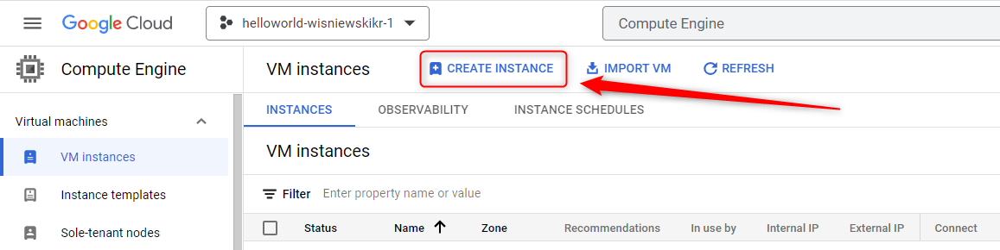

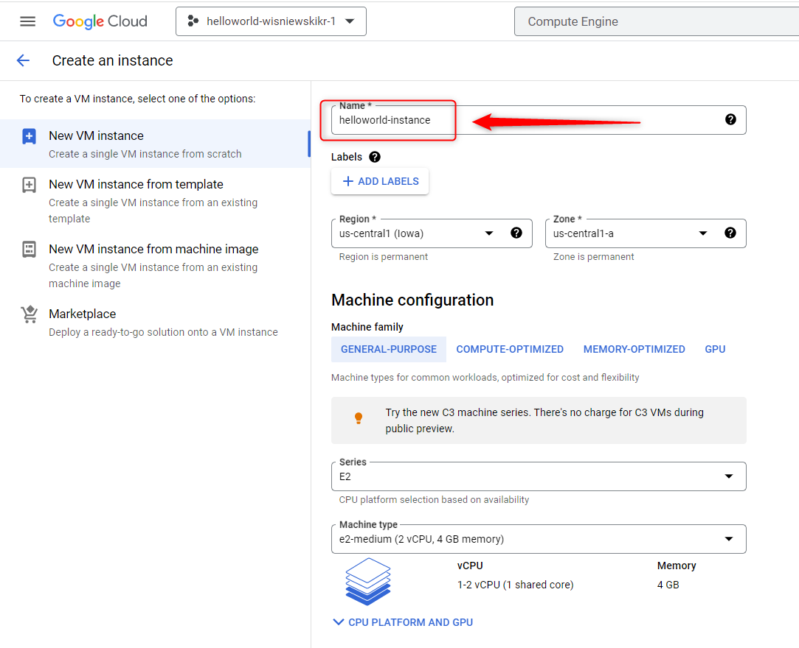

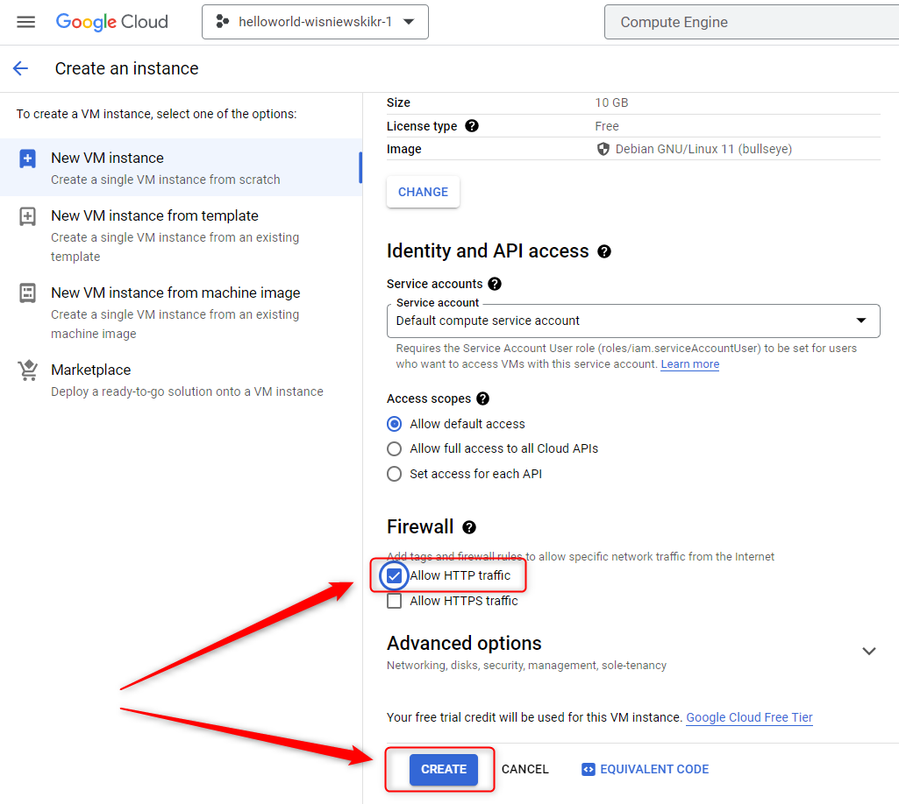

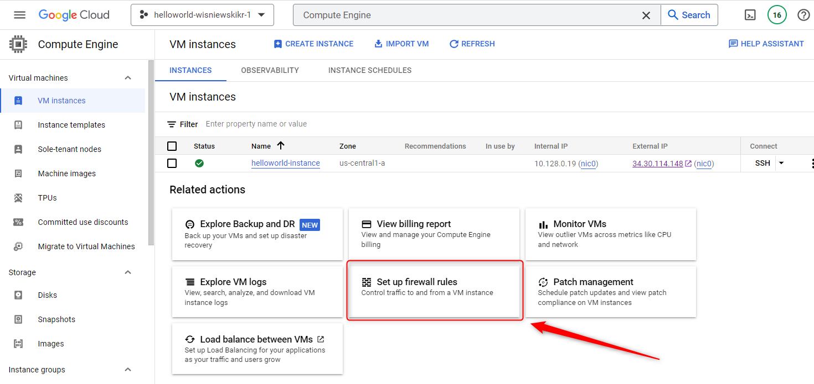

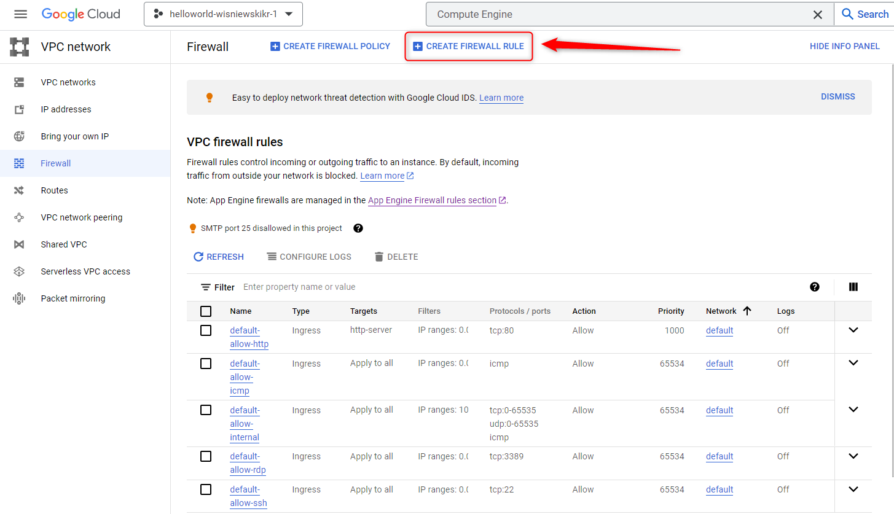

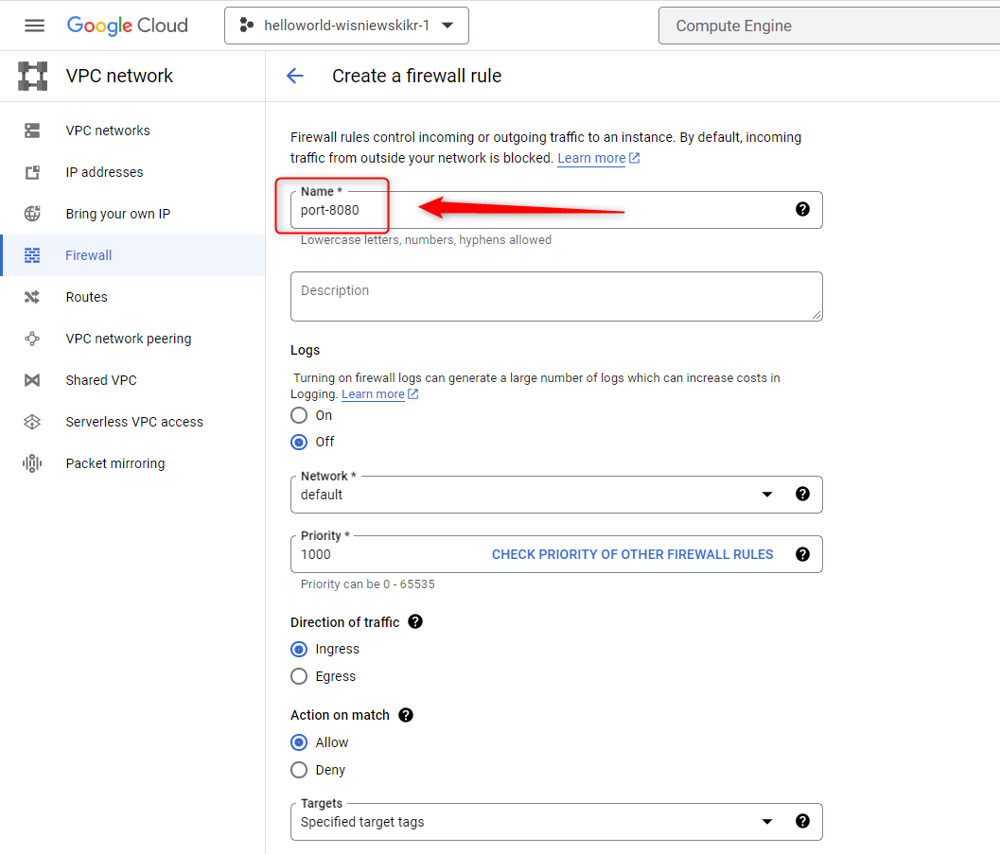

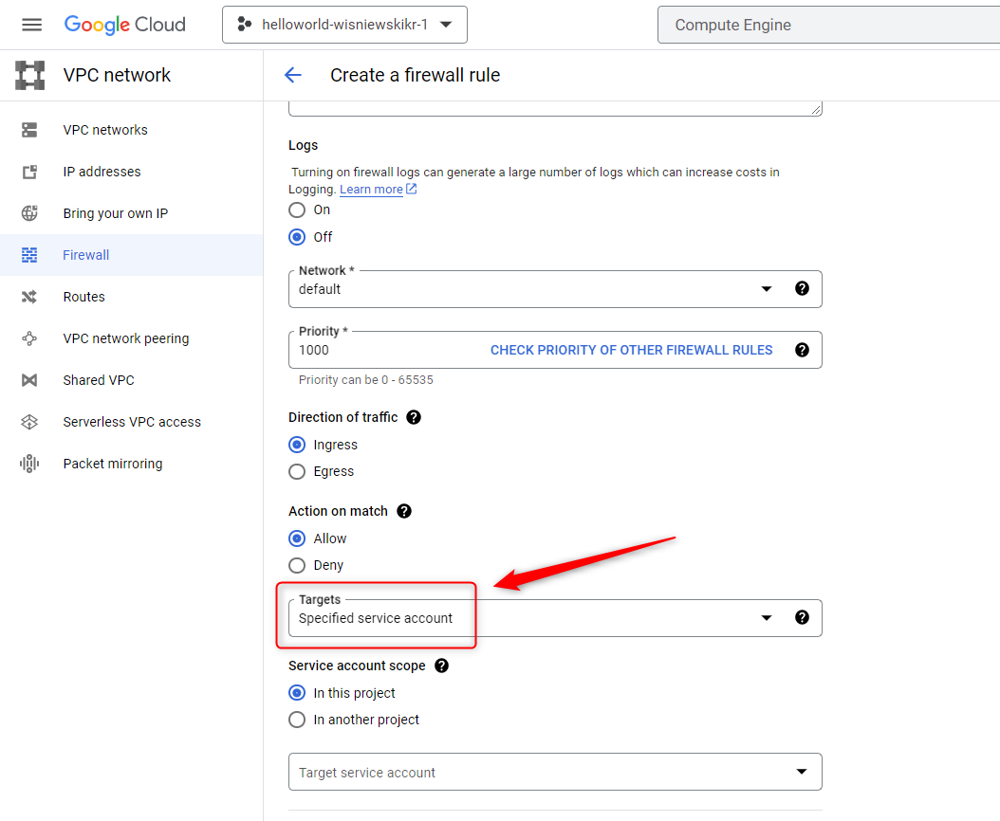

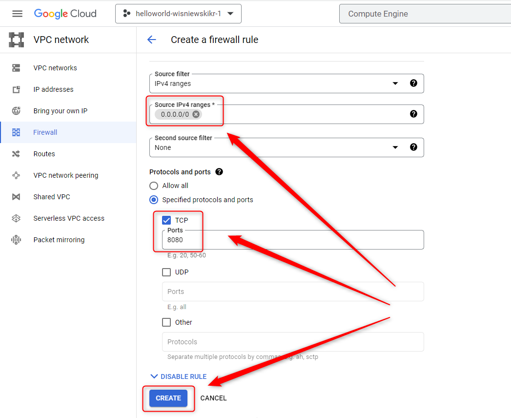

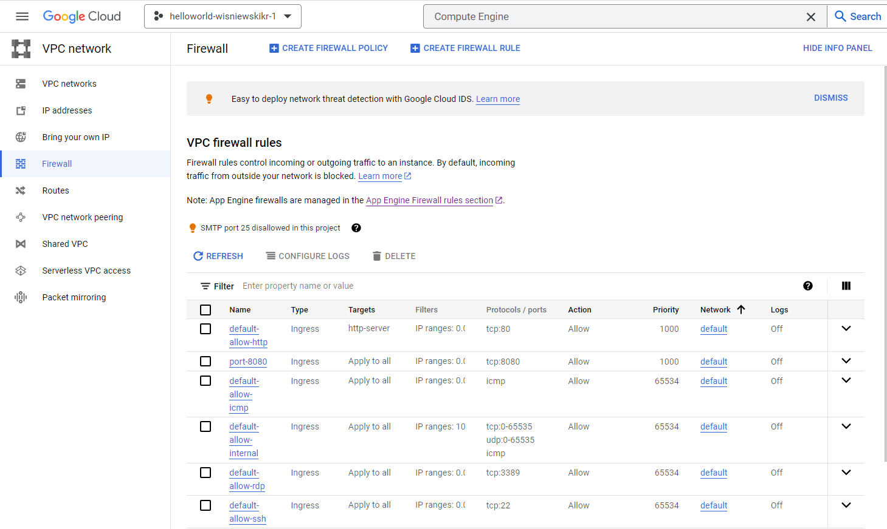

DEPLOY APPLICATION VIA SSH
--------------------------

Link:
* https://console.cloud.google.com/

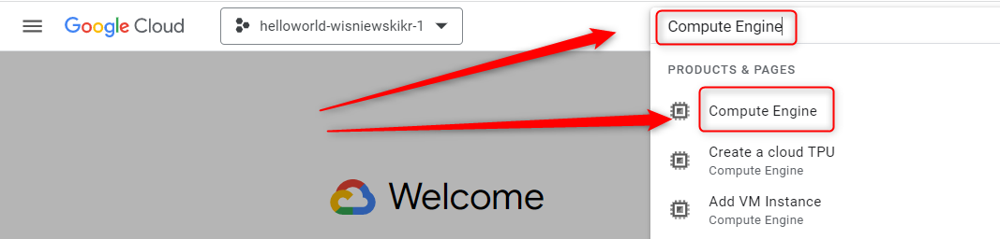

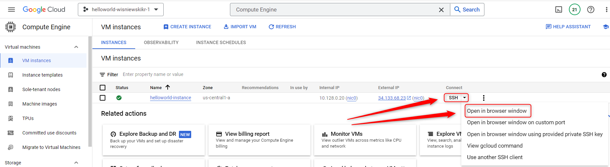

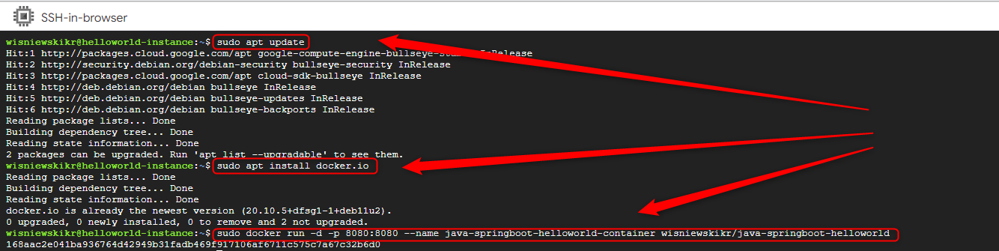

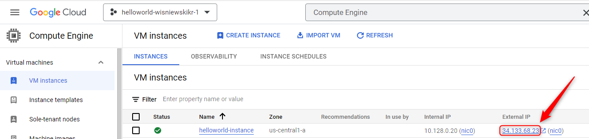

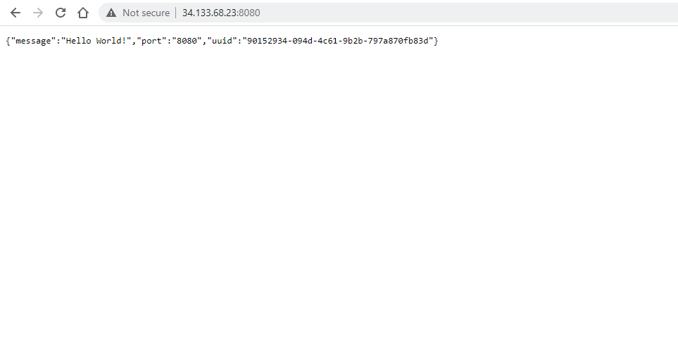

DELETE GCP COMPUTE ENGINE
----------------------------

Link:
* https://console.cloud.google.com/

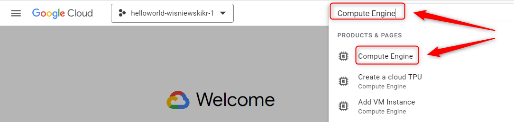

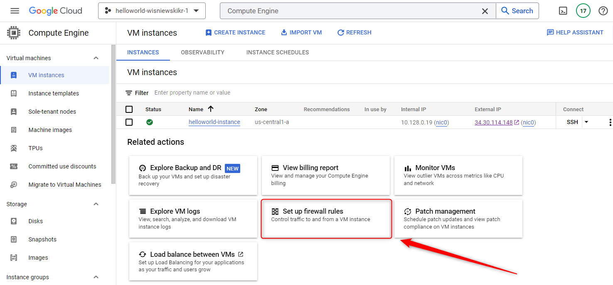

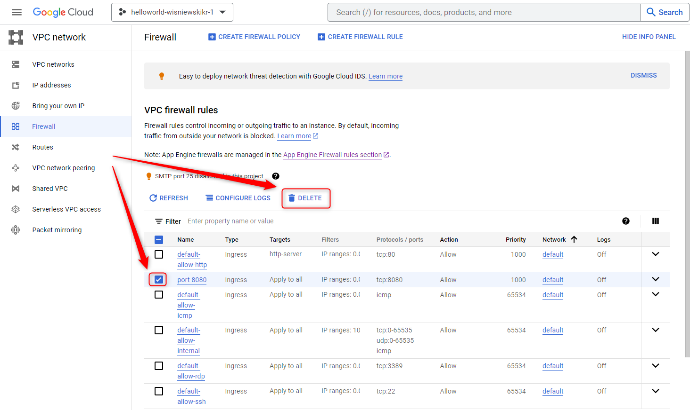

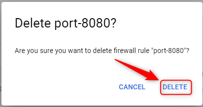

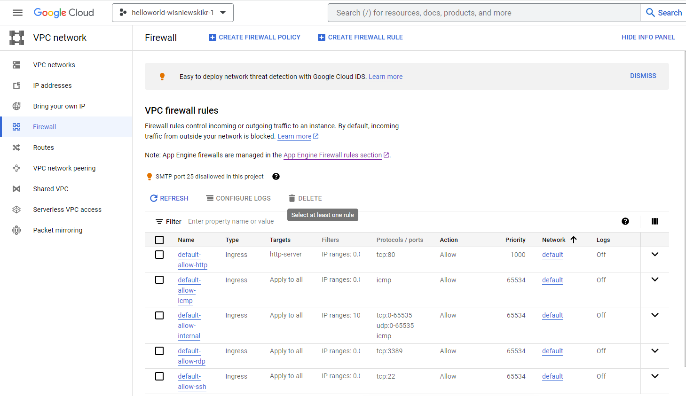

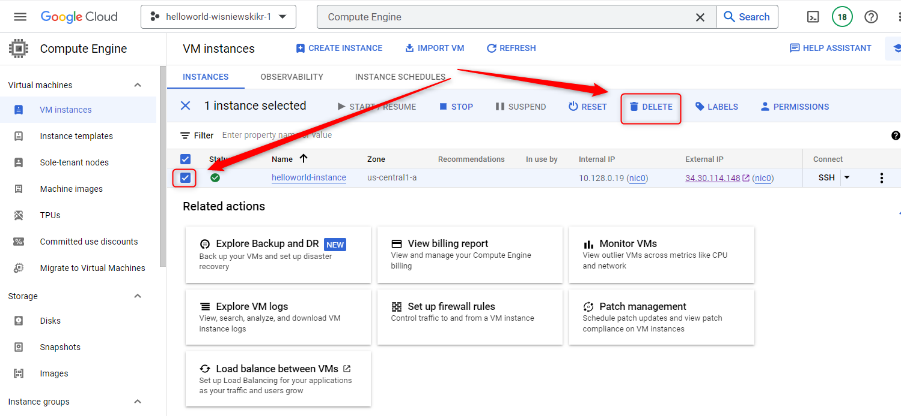

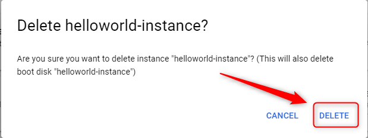

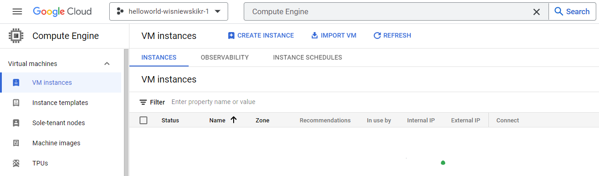