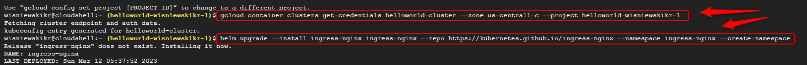

USAGE
-----

> **NOTE** This usage assumes that user possesses **Google Account** with existing **GCP Project**. It also assumes that application's **Docker Image** is stored on public **Docker Hub** repository.

Steps:
1. Create GCP Kubernetes Engine. Please check section **CREATE GCP KUBERNETES ENGINE**
1. Deploy application on Kubernetes Cluster. Please check section **DEPLOY APPLICATION AS KUBERNETES**
     * Connect with GCP Kubernetes Engine with `gcloud container clusters get-credentials helloworld-cluster --zone us-central1-c --project helloworld-wisniewskikr-1`     
     * Install Ingress Controller type Nginx using tool helm with `helm upgrade --install ingress-nginx ingress-nginx --repo https://kubernetes.github.io/ingress-nginx --namespace ingress-nginx --create-namespace`
     * (Optional) Verify Ingress Controller type Nginx with `kubectl get service ingress-nginx-controller --namespace=ingress-nginx`
     * Clone GIT project with `git clone https://github.com/wisniewskikr/chrisblog-it-gcp.git`
     * Deploy application on Kubernetes with `kubectl apply -f chrisblog-it-gcp/kubernetes-engine/java-springboot-helloworld-gcp-kubernetes-engine-console-lb-ingress-nginx/kubernetes.yaml`
     * (Optional) Verify Kubernetes Pods with `kubectl get pods`
     * (Optional) Verify Kubernetes Services with `kubectl get svc`
     * Get EXTERNAL-IP with `kubectl get service ingress-nginx-controller --namespace=ingress-nginx`
     * Verify application with `http://{EXTERNAL-IP}`
1. Delete GCP Kubernetes Engine. Please check section **DELETE GCP KUBERNETES ENGINE**

DESCRIPTION
-----------

##### Goal
The goal of this project is to present how to deploy **Kubernetes** application on **GCP Kubernetes Engine** using **GCP Console**. This application uses **Load Balancer** type **Ingress Nginx**. This Kubernetes uses Docker Image published on Docker Hub of **Java Spring Boot** application.

##### Terminology
Terminology explanation:
* **GCP**: it means Google Cloud Platform (GCP). There are compute services provided by Google via Internet
* **GCP Kubernetes Engine**: it's GCP service which enables deploying of Kubernetes applications on Google Cloud
* **GCP Console**: it's web application which enables working with Google Cloud Platform (GCP) via internet's browser
* **Java Spring Boot application**: it's application in Java programming language which uses Spring Boot framework. This application displays "Hello World" message, port and uuid in JSON format
* **Load Balancer**: this application redirects traffic to different instances of the same service
* **Ingress Nginx**: it's Load Balancer type Ingress. Type Ingress means that first Ingress Controller of specific provider has to be installed and then developer can use common Ingress configuration files. In this case Ingress provider is Nginx
* **kubectl**: this command line tool enables working with Kubernetes
* **helm**: this command line tool enables working with Kubernetes configuration files

##### Flow
The following flow takes place in this project:
1. User creates GCP Kubernetes Engine
1. User installs Load Balancer type Ingress Nginx using tool "helm"
1. User deploys application on Kubernetes Cluster stored in Google Cloud
1. User opens deployed application URL in browser
1. User via any browser sends request to application for a content
1. Application HelloWorld returns response with JSON containing message, port and UUID. This response is presented to User via browser
1. User cleans up

##### Launch
To launch this application please make sure that the **Preconditions** are met and then follow instructions from **Usage** section.

##### Technologies
This project uses following technologies:
* **Java**: `https://docs.google.com/document/d/119VYxF8JIZIUSk7JjwEPNX1RVjHBGbXHBKuK_1ytJg4/edit?usp=sharing`
* **Maven**: `https://docs.google.com/document/d/1cfIMcqkWlobUfVfTLQp7ixqEcOtoTR8X6OGo3cU4maw/edit?usp=sharing`
* **Git**: `https://docs.google.com/document/d/1Iyxy5DYfsrEZK5fxZJnYy5a1saARxd5LyMEscJKSHn0/edit?usp=sharing`
* **Spring Boot**: `https://docs.google.com/document/d/1mvrJT5clbkr9yTj-AQ7YOXcqr2eHSEw2J8n9BMZIZKY/edit?usp=sharing`
* **GCP**: `https://docs.google.com/document/d/1uXYLLTgD9b3RPs83S57WAsfCnuOrR9RdTJ7HLcaRzNY/edit?usp=sharing`

PRECONDITIONS
-------------

##### Preconditions - Tools
* Installed **Operating System** (tested on Windows 10)

##### Preconditions - Actions
* Created **Google Account**
* Created **GCP Project**: `https://github.com/wisniewskikr/chrisblog-it-gcp/tree/main/other/gcp-project-console`
* Prepared **Source Code** of application: `https://github.com/wisniewskikr/java-springboot-helloworld`
* Prepared **Docker Image** of application: `https://hub.docker.com/repository/docker/wisniewskikr/java-springboot-helloworld/general`

CREATE GCP KUBERNETES ENGINE
----------------------------

Link:
* https://console.cloud.google.com/

DEPLOY APPLICATION AS KUBERNETES
--------------------------------

Link:
* https://console.cloud.google.com/

DELETE GCP KUBERNETES ENGINE
----------------------------

Link:
* https://console.cloud.google.com/

