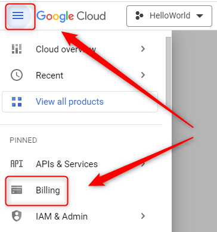
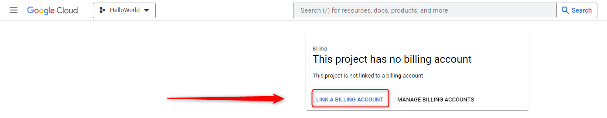
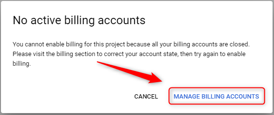
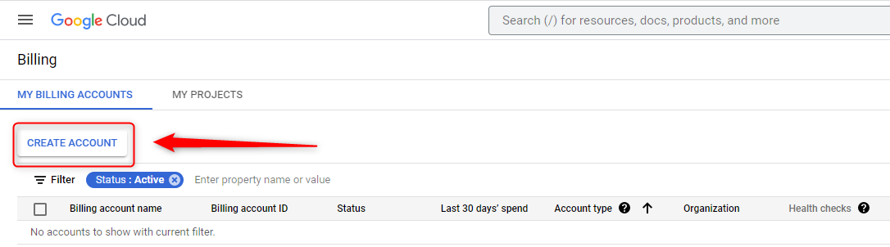
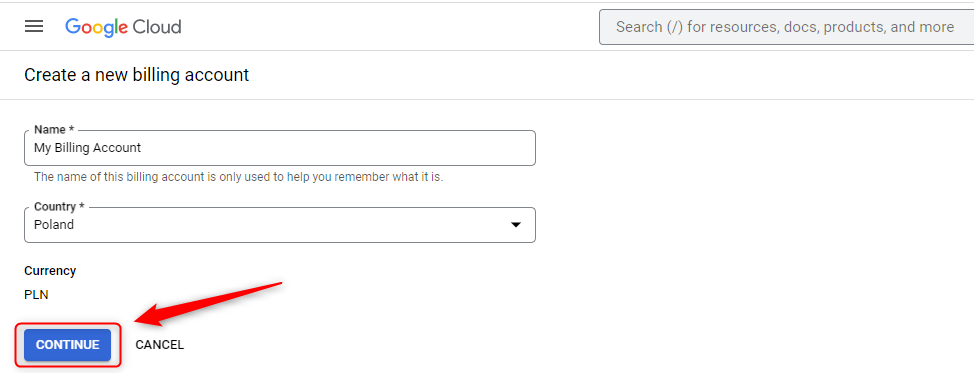
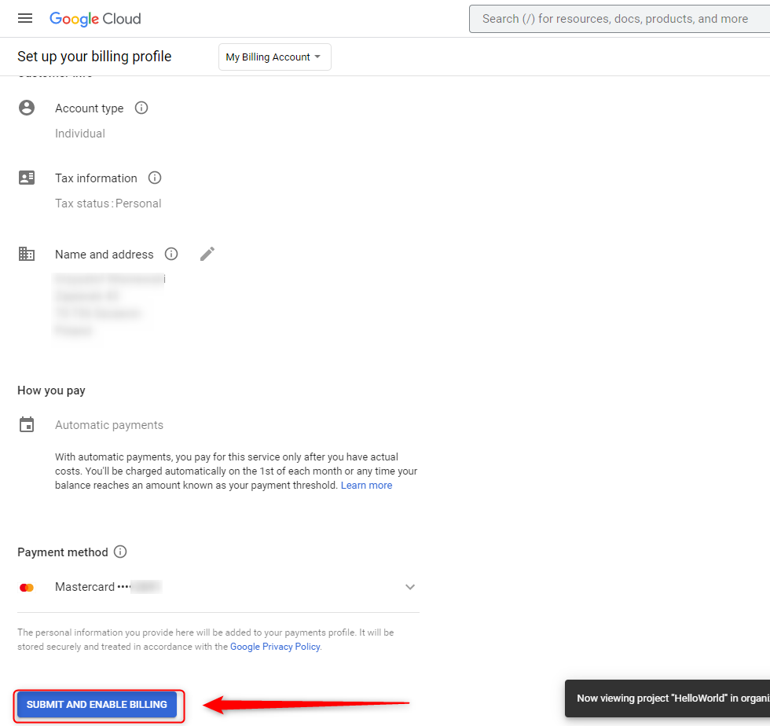
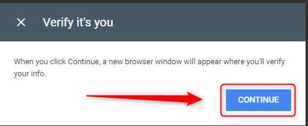
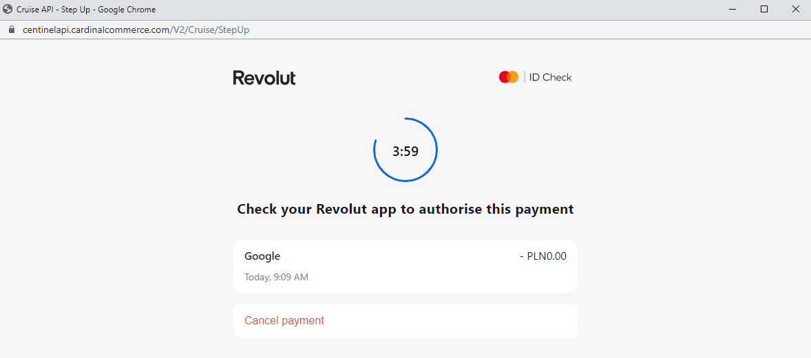
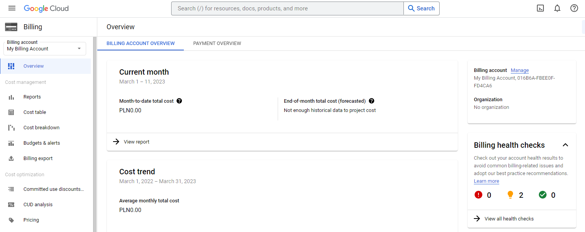

USAGE
-----

> **NOTE** This usage assumes that user is logged in to **Google Account**

Steps:
1. Create GCP Billing. Please check section **CREATE BILLING**

DESCRIPTION
-----------

##### Goal
The goal of this project is to present how to create billing of **GCP** - how to pay for this service.

##### Terminology
Terminology explanation:
* **GCP**: it means Google Cloud Platform (GCP) and provided compute services via Internet

##### Flow
The following flow takes place in this project:
1. User creates GCP Billing

##### Launch
To launch this application please make sure that the **Preconditions** are met and then follow instructions from **Usage** section.

##### Technologies
This project uses following technologies:
* **GCP**: `https://docs.google.com/document/d/1uXYLLTgD9b3RPs83S57WAsfCnuOrR9RdTJ7HLcaRzNY/edit?usp=sharing`

PRECONDITIONS
-------------

##### Preconditions - Tools
* Installed **Operating System** (tested on Windows 10)

##### Preconditions - Actions
* Created Google Account

CREATE BILLING
--------------

Link:
* https://console.cloud.google.com/

