USAGE
-----

> **NOTE** This usage assumes that user posseses **Google Account**

Steps:
1. Install GCP Cloud Cli. Please check section **INSTALL CLOUD CLI**

DESCRIPTION
-----------

##### Goal
The goal of this project is to present how to install **GCP Cloud CLI**.

##### Terminology
Terminology explanation:
* **GCP**: it means Google Cloud Platform (GCP) and it provides compute services via Internet
* **Cloud Cli**: tool which enables managing GCP Resources via command lines

##### Flow
The following flow takes place in this project:
1. User installs GCP Cloud Cli

##### Launch
To launch this application please make sure that the **Preconditions** are met and then follow instructions from **Usage** section.

##### Technologies
This project uses following technologies:
* **GCP**: `https://docs.google.com/document/d/1uXYLLTgD9b3RPs83S57WAsfCnuOrR9RdTJ7HLcaRzNY/edit?usp=sharing`

PRECONDITIONS
-------------

##### Preconditions - Tools
* Installed **Operating System** (tested on Windows 10)

##### Preconditions - Actions
* Created Google Account

INSTALL CLOUD CLI
-----------------

Link:
* `https://cloud.google.com/sdk/docs/install-sdk?authuser=1`

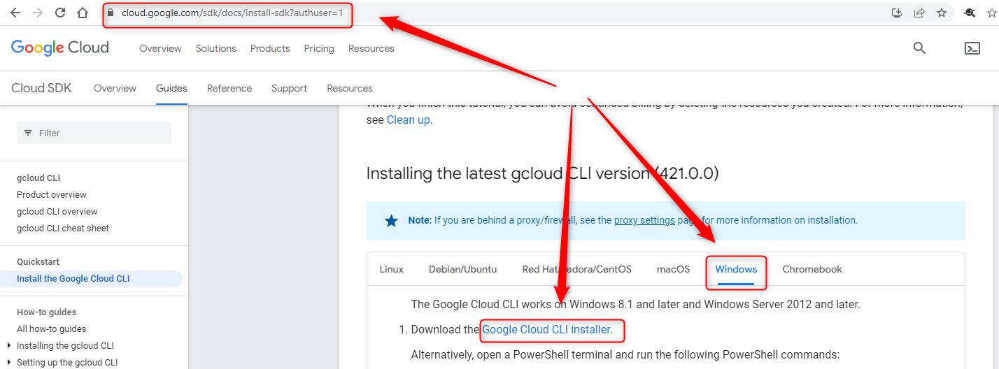

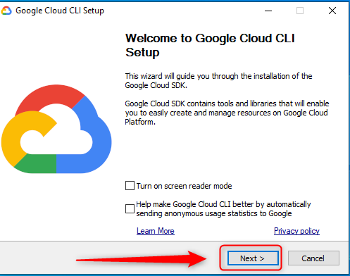

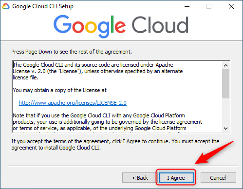

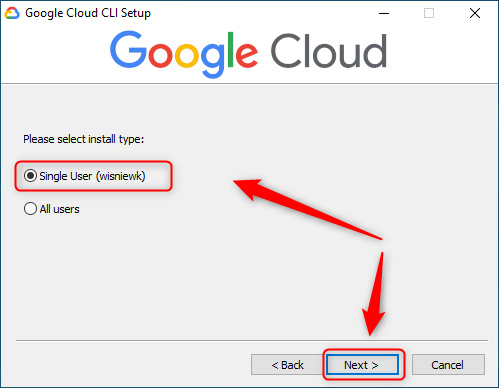

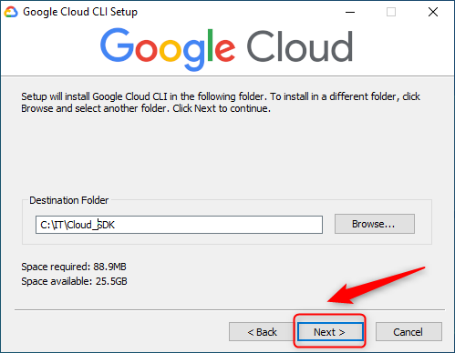

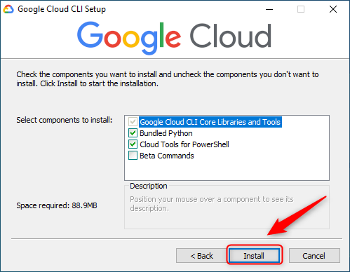

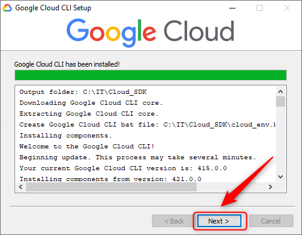

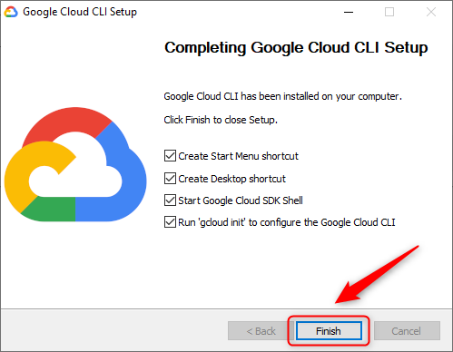

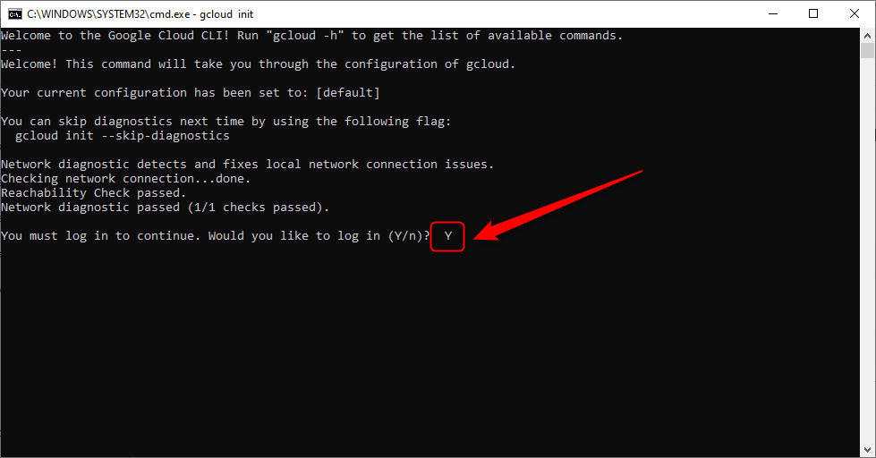

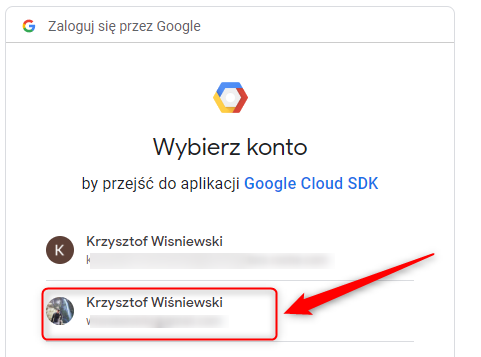

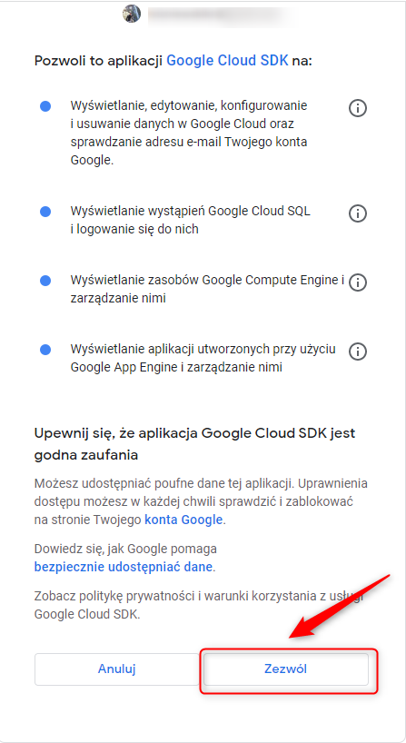

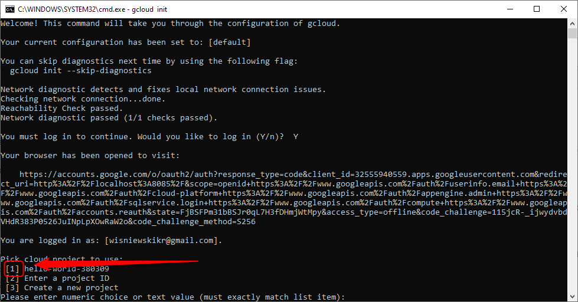
