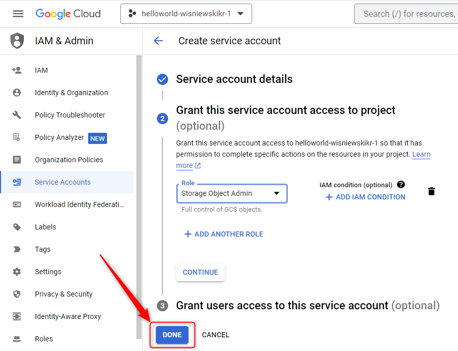

USAGE
-----

> **NOTE** This usage assumes that user possesses **Google Account** with existing **GCP Project**. 

Steps:
1. Create GCP IAM Service Account. Please check section **CREATE GCP IAM SERVICE ACCOUNT**
1. Delete GCP IAM Service Account. Please check section **DELETE GCP IAM SERVICE ACCOUNT**

DESCRIPTION
-----------

##### Goal
The goal of this project is to present how to manage **GCP IAM Service Accounts** using **GCP Console**.

##### Terminology
Terminology explanation:
* **GCP**: it means Google Cloud Platform (GCP). There are compute services provided by Google via Internet
* **GCP IAM Service Account**: it's GCP service which enables managing accounts of GCP. Here you can create new account, add some roles and generate private key for this account as file. Using this file in application you will have access to GCP service API according to this role
* **GCP Console**: it's web application which enables working with Google Cloud Platform (GCP) via internet's browser

##### Flow
The following flow takes place in this project:
1. User creates GCP IAM Service Account
1. User cleans up

##### Launch
To launch this application please make sure that the **Preconditions** are met and then follow instructions from **Usage** section.

##### Technologies
This project uses following technologies:
* **GCP**: `https://docs.google.com/document/d/1uXYLLTgD9b3RPs83S57WAsfCnuOrR9RdTJ7HLcaRzNY/edit?usp=sharing`

PRECONDITIONS
-------------

##### Preconditions - Tools
* Installed **Operating System** (tested on Windows 10)

##### Preconditions - Actions
* Created **Google Account**
* Created **GCP Project**: `https://github.com/wisniewskikr/chrisblog-it-gcp/tree/main/other/gcp-project-console`

CREATE GCP IAM SERVICE ACCOUNT
------------------------------

Link:
* https://console.cloud.google.com/

DELETE GCP IAM SERVICE ACCOUNT
------------------------------

Link:
* https://console.cloud.google.com/

