USAGE
-----

> **NOTE** This usage assumes that user is logged in to **Google Account**

Steps:
1. Create GCP Project. Please check section **CREATE GCP PROJECT**
1. Work with GCP Project. Please check section **WORK WITH GCP PROJECT**
1. Delete GCP Project. Please check section **Delete GCP PROJECT**

DESCRIPTION
-----------

##### Goal
The goal of this project is to present how to create, work with and delete **GCP Project** using **GCP Console**.

##### Terminology
Terminology explanation:
* **GCP Project**: it's Project of Google Cloud Platform (GCP) which contains GCP Resources. GCP Resources are services provided by Google for cloud computing. And every Resouce has to be stored in some Project
* **GCP Console**: it's web application which enables working with Google Cloud Platform (GCP) via internet's browser

##### Flow
The following flow takes place in this project:
1. User creates GCP Project
1. User works with GCP Project - checks IAM, API, Resources etc.
1. User deletes GCP Project

##### Launch
To launch this application please make sure that the **Preconditions** are met and then follow instructions from **Usage** section.

##### Technologies
This project uses following technologies:
* **GCP**: `https://docs.google.com/document/d/1uXYLLTgD9b3RPs83S57WAsfCnuOrR9RdTJ7HLcaRzNY/edit?usp=sharing`

PRECONDITIONS
-------------

##### Preconditions - Tools
* Installed **Operating System** (tested on Windows 10)

##### Preconditions - Actions
* Created Google Account

CREATE GCP PROJECT
------------------

Link:
* https://console.cloud.google.com/

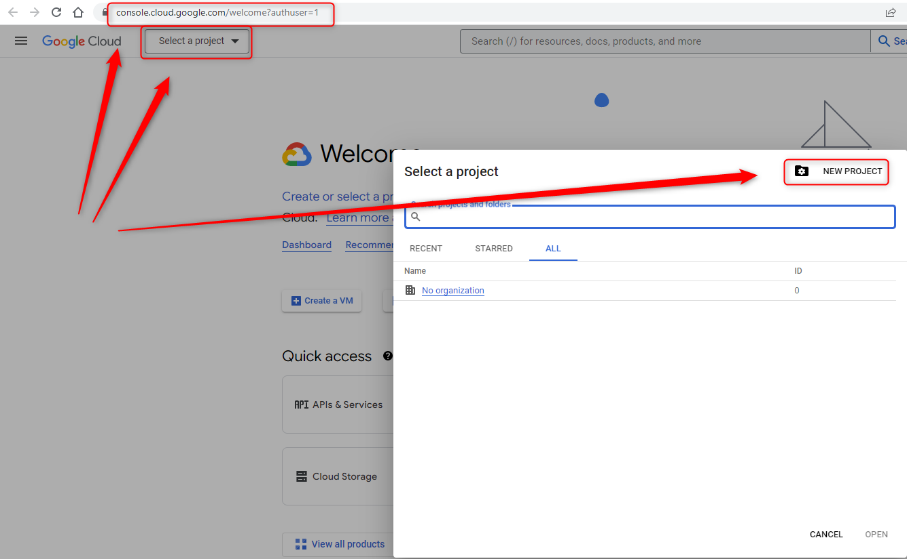

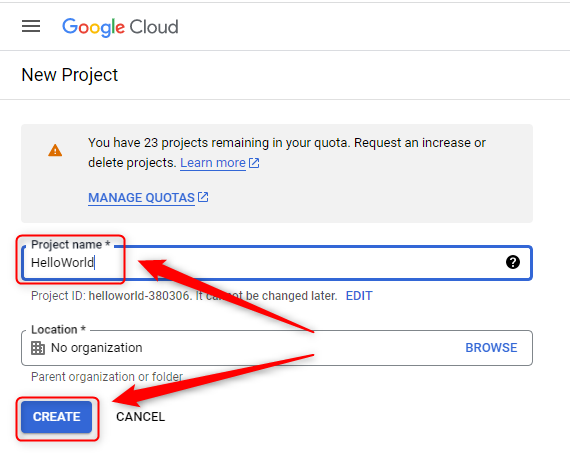

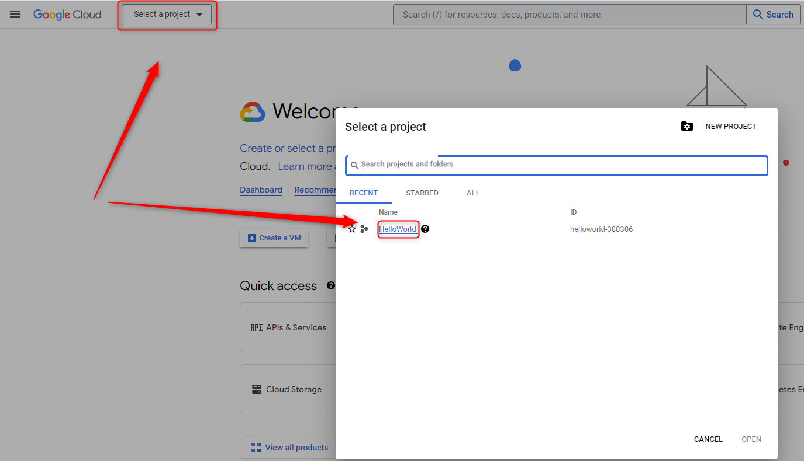

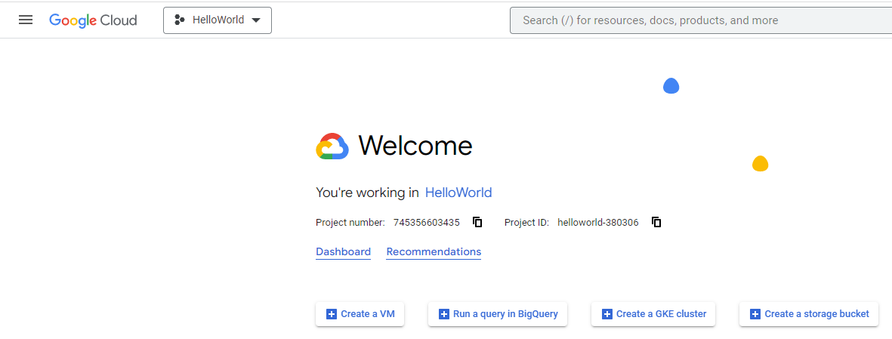

WORK WITH GCP PROJECT
---------------------

Link:
* https://console.cloud.google.com/

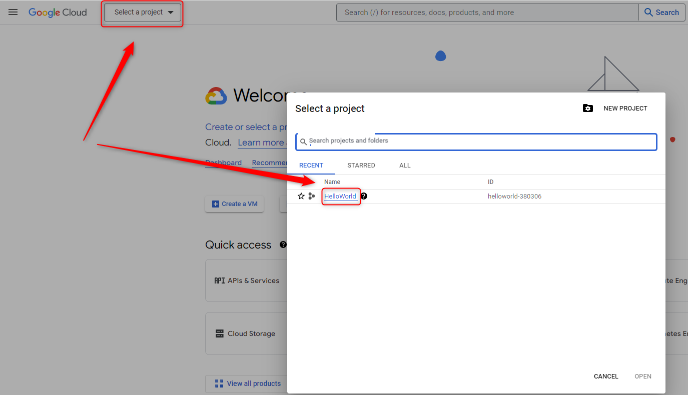

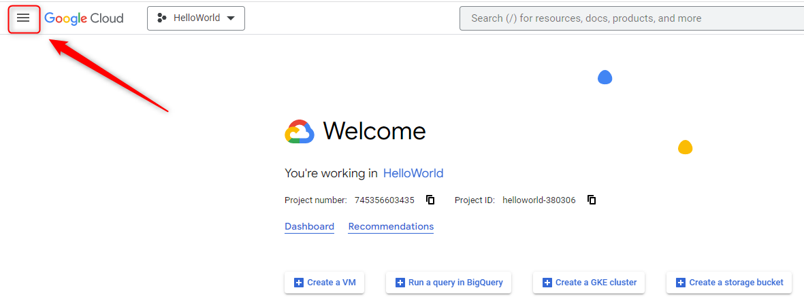

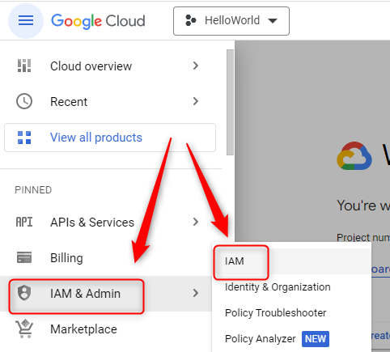

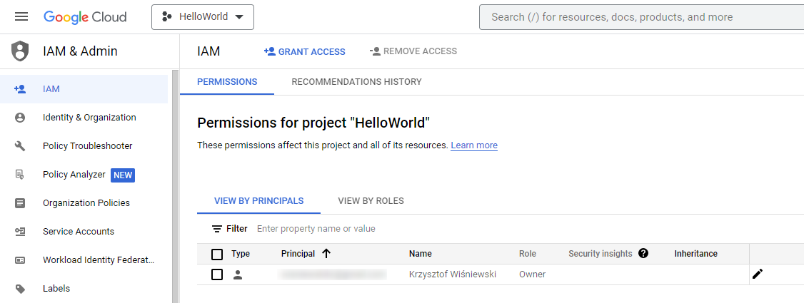

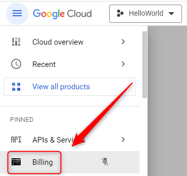

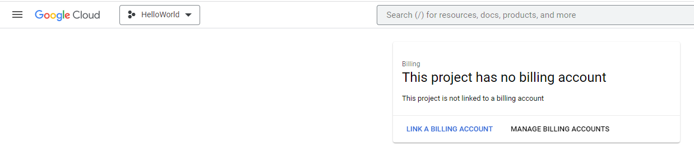

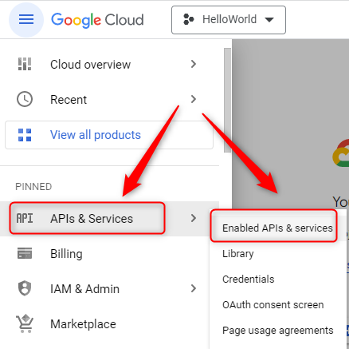

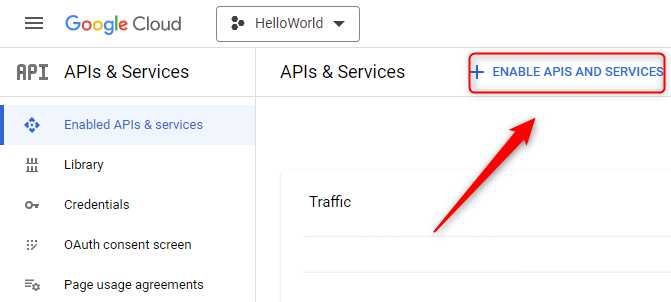

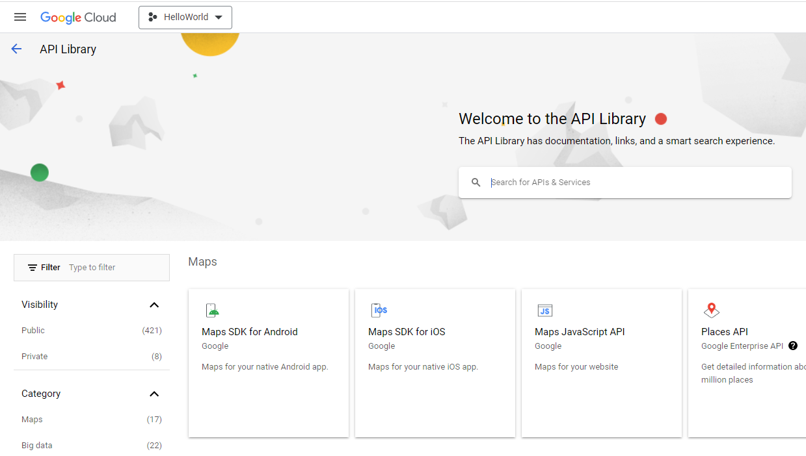

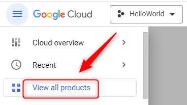

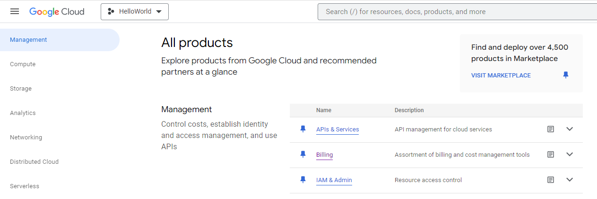

DELETE GCP PROJECT
------------------

Link:
* https://console.cloud.google.com/

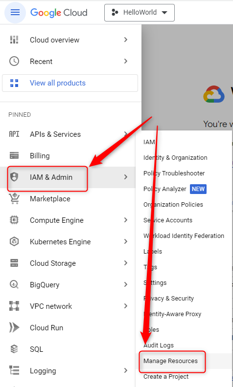

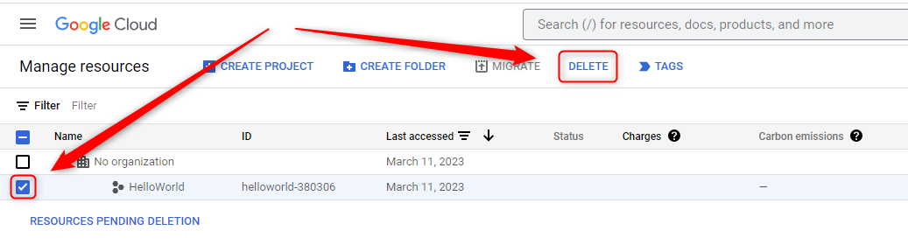

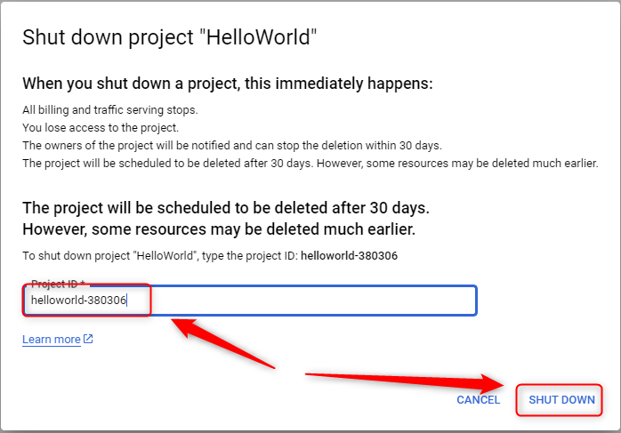

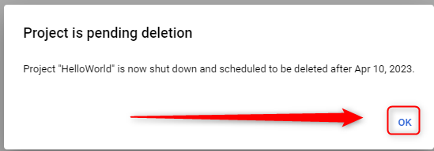

